# 📱 GameVault - Gestión de Videojuegos con Firebase

**Desarrollado por:** Valentino Guevara  
**Contacto:** [202114033@uns.edu.pe](mailto:202114033@uns.edu.pe)  
**GitHub:** [ValentinoGuevara](https://github.com/ValentinoGuevara)  
**Curso:** Aplicaciones Móviles - Semana 10  

<div align="center">
  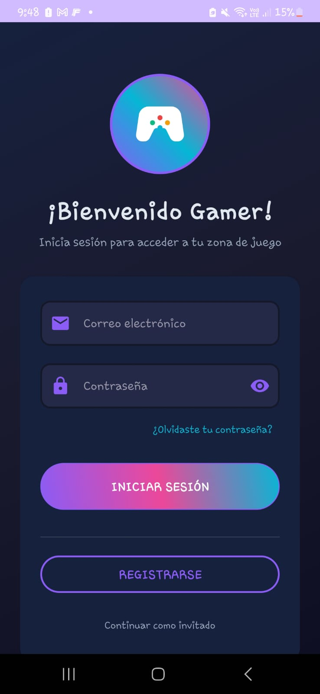
</div>

## 🔍 ¿Cómo funciona la aplicación?

**GameVault** es una aplicación Android diseñada para coleccionistas de videojuegos, que permite gestionar el registro de juegos con persistencia en la nube a través de **Firebase**. Esta app incluye autenticación segura y sincronización en tiempo real de los datos. Además, ofrece una interfaz de usuario moderna y atractiva basada en **Material Design 3**.

### 🏗️ **Arquitectura del Proyecto**

1. **Autenticación segura con Firebase**:
   - Registro, inicio de sesión y recuperación de contraseñas.
   - **Login anónimo** (modo invitado) y verificación de correo electrónico.

2. **Gestión de Videojuegos**:
   - Registro y visualización de juegos favoritos.
   - **Edición** y **eliminación** de juegos, con validación de campos.

3. **Interfaz interactiva**:
   - **Búsqueda inteligente** de juegos con filtros dinámicos.
   - **Tema gaming** con colores neón, modo oscuro y efectos visuales atractivos.

### 🛠️ **Tecnologías Utilizadas**

| **Tecnología**                 | **Uso**                      | **Beneficio**                     |
|---------------------------------|------------------------------|-----------------------------------|
| Firebase Authentication         | Gestión de usuarios          | Autenticación segura              |
| Firebase Realtime Database      | Almacenamiento en tiempo real | Sincronización instantánea        |
| Material Design 3               | Diseño de interfaz de usuario | Experiencia moderna y accesible  |
| Kotlin Parcelize                | Paso de objetos entre pantallas | Optimización de rendimiento      |
| Corrutinas                      | Operaciones asíncronas        | Interfaz fluida sin bloqueos      |

### 🌟 **Características Principales**

#### 🔐 **Autenticación Completa**

- **Registro con correo electrónico** y verificación de email.
- **Login anónimo** para usar la app sin necesidad de registro.
- **Recuperación de contraseña** en caso de olvido.

#### 🕹 **Gestión de Videojuegos**

- Añadir nuevos juegos con detalles como título, género, plataforma, etc.
- Editar cualquier campo del juego.
- Eliminar juegos de la base de datos con confirmación.

#### 🔍 **Búsqueda y Filtros Inteligentes**

- Filtrado en tiempo real mientras escribes.
- Búsqueda por **género** y **título** de los juegos.

### 📱 **Galería de Capturas**

<div align="center">
  <h3>🎨 Interfaz de Usuario</h3>
  <table>
    <tr>
      <td></td>
      <td>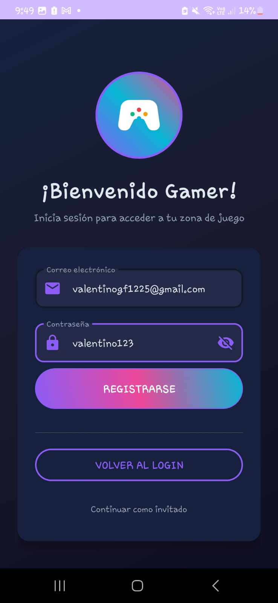</td>
      <td>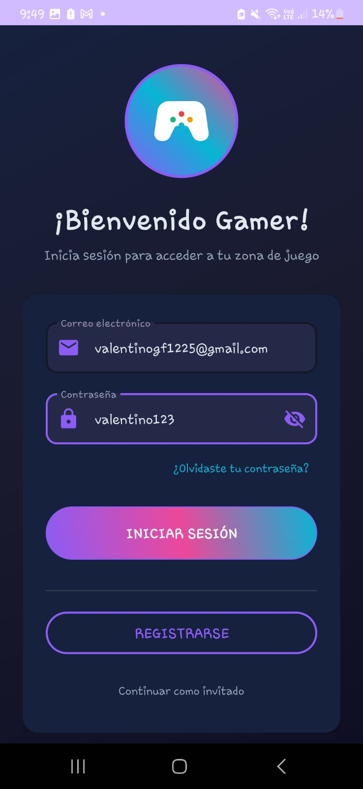</td>
    </tr>
    <tr>
      <td></td>
      <td>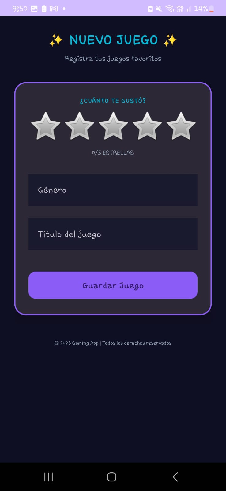</td>
      <td></td>
    </tr>
    <tr>
      <td>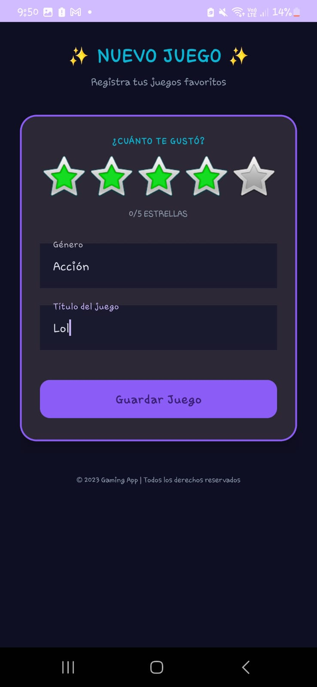</td>
      <td>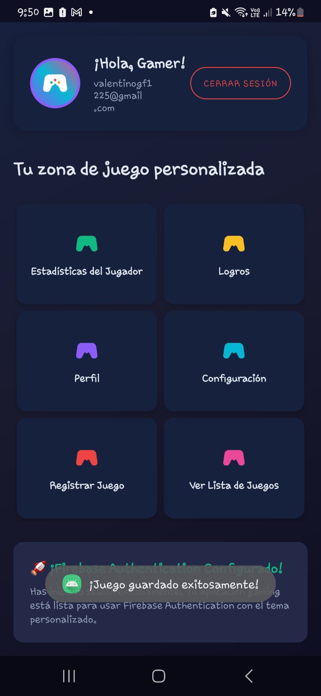</td>
      <td>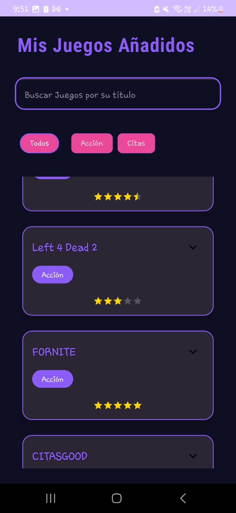</td>
    </tr>
    <tr>
      <td></td>
      <td>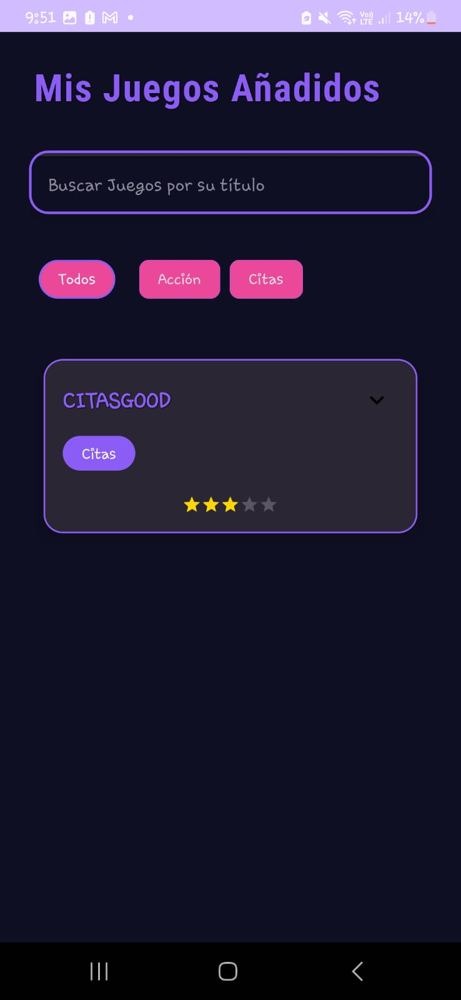</td>
      <td>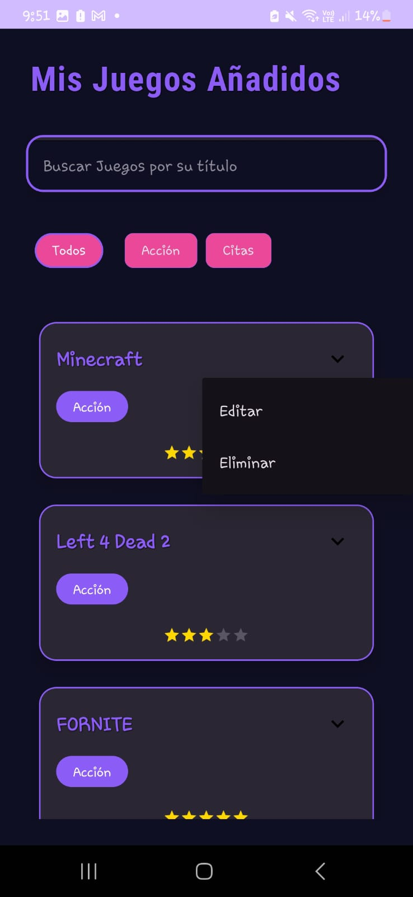</td>
    </tr>
    <tr>
      <td></td>
      <td>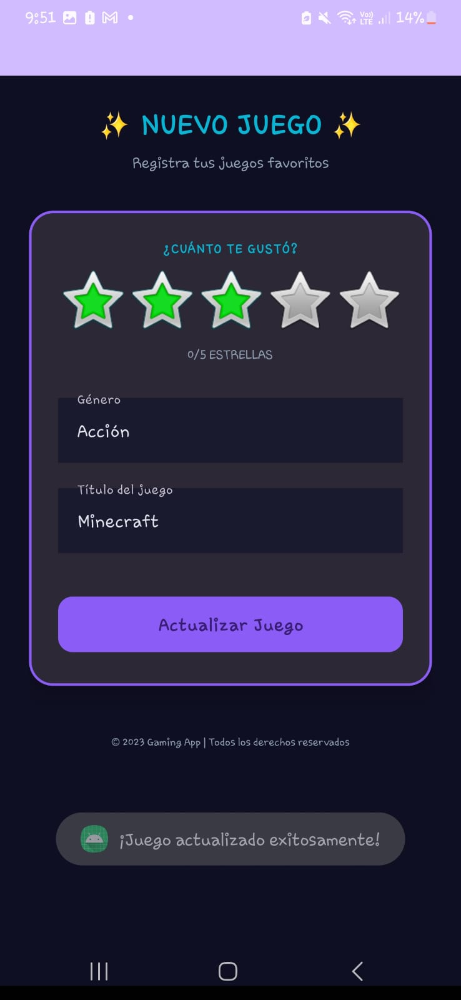</td>
      <td>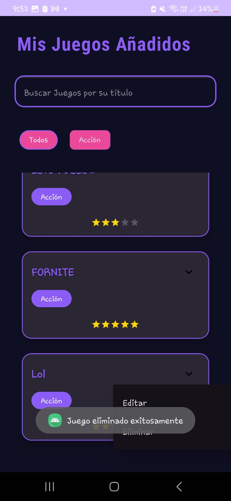</td>
    </tr>
  </table>
  <p>¡Captura real de la aplicación en acción!</p>
</div>

## 🛠️ **Implementación Técnica**

### **Firebase Configuration**  
1. **Configuración de Firebase Authentication:**
   - Habilita el inicio de sesión con **correo electrónico/contraseña**.
   - Habilita el **login anónimo** para permitir el uso sin registro.

2. **Firebase Realtime Database:**
   - Crea una base de datos en **Realtime Database** para almacenar los juegos de cada usuario.
   - Establece reglas de seguridad para que cada usuario solo pueda acceder y modificar sus propios juegos.

```json
{
  "rules": {
    "games": {
      "$uid": {
        ".read": "$uid === auth.uid",
        ".write": "$uid === auth.uid"
      }
    }
  }
}
```
2️⃣ Configuración de Firebase
Ve a Firebase Console y crea un proyecto llamado GameVault.

Configura la autenticación con correo y habilita el acceso anónimo.

Agrega tu aplicación Android a Firebase, descarga el archivo google-services.json y reemplázalo en el directorio app.

3️⃣ Instalación de Dependencias
En el archivo app/build.gradle.kts, agrega la dependencia de Firebase Realtime Database:

kotlin
Copiar
Editar
implementation("com.google.firebase:firebase-database:20.3.0")
4️⃣ Ejecutar la Aplicación
Abre el proyecto en Android Studio y espera a que Gradle se sincronice.

Ejecuta la app en tu dispositivo o emulador:

bash
Copiar
Editar
Run ▶️
🎮 Cómo Usar la App
Primera vez: Regístrate con tu correo electrónico y contraseña.

Login: Ingresa tus credenciales para acceder al dashboard.

Modo Invitado: Haz clic en "Continuar como invitado" para usar la app sin registrarte.

Añadir Juegos: Registra juegos con detalles como título, género, plataforma y rating.

Visualizar Juegos: Visualiza todos los juegos registrados y filtra por género o rating.

🌟 Avances Fututos
Edición de juegos: Permitir que los usuarios editen los juegos existentes.

Eliminación de juegos: Implementar un sistema para eliminar juegos con confirmación.

Búsqueda avanzada: Mejorar la búsqueda con múltiples filtros por género, título y rating.

📚 Licencia
Copyright © 2025 - Valentino Guevara
Prohibido el uso comercial sin autorización expresa.

<div align="center">  <p>¡Explora el código y contribuye!</p> <a href="https://github.com/ValentinoGuevara/S9_SharedPreferences">  </a> </div> ```
