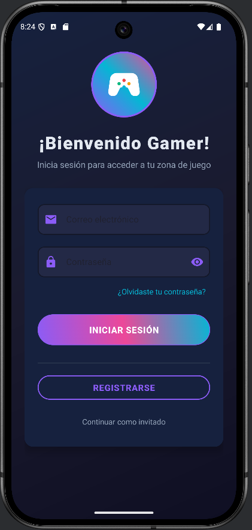
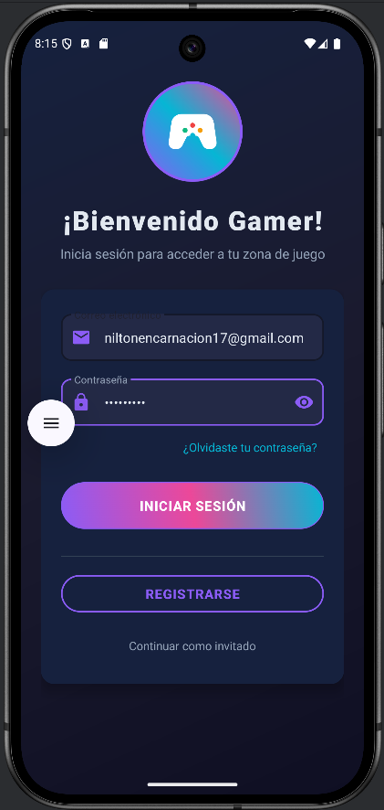
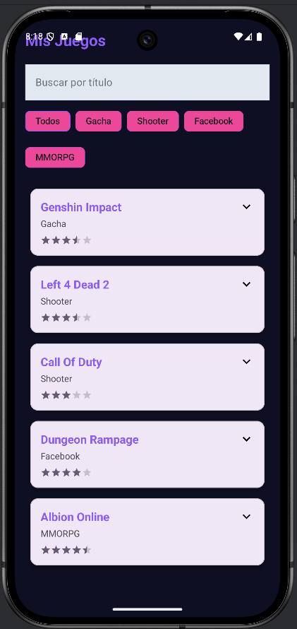
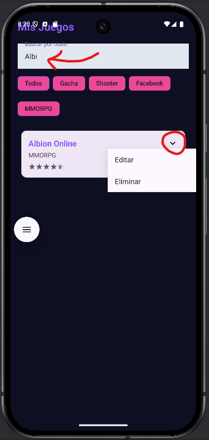
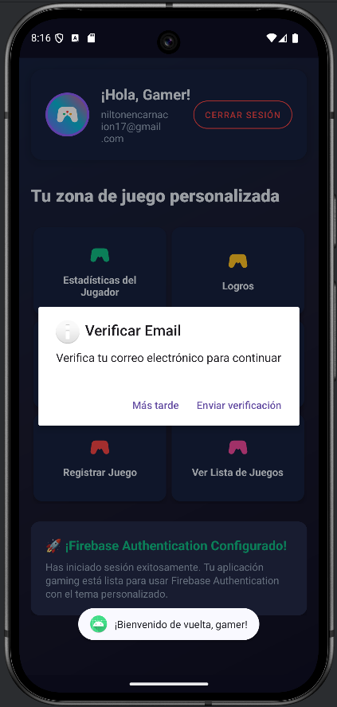
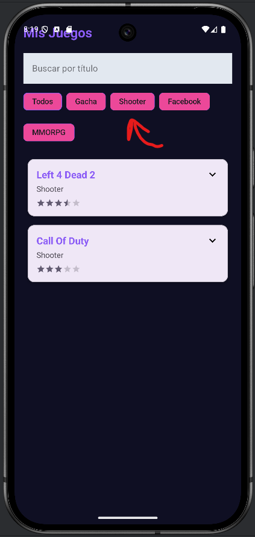
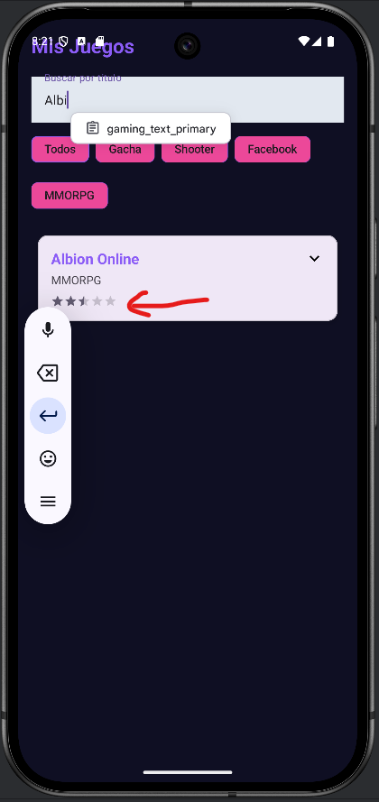

# 🎮 GameVault - Tu Biblioteca de Videojuegos

Una aplicación Android moderna para coleccionistas de videojuegos, con autenticación segura y almacenamiento en la nube utilizando Firebase.

## 🛠 Tecnologías Clave

| Tecnología | Uso | Beneficio |
|------------|-----|-----------|
| **Firebase Authentication** | Gestión segura de usuarios | Protección de datos personales |
| **Firebase Realtime Database** | Almacenamiento en tiempo real | Sincronización instantánea |
| **Material Design 3** | Interfaz de usuario | Experiencia moderna y accesible |
| **Kotlin Parcelize** | Paso de objetos entre pantallas | Optimización de rendimiento |
| **Corrutinas** | Operaciones asíncronas | Interfaz fluida sin bloqueos |

## 🌟 Características Principales

### 🔐 Autenticación Segura

- Registro con verificación por email
- Inicio de sesión persistente
- Recuperación de contraseña

### 🕹 Gestión Completa de Juegos

- **Añadir juegos** con todos los detalles
- **Edición flexible** de cualquier campo
- **Eliminación segura** con confirmación
- **Visualización** de cada juego

### 🔍 Búsqueda Inteligente

- Filtrado en tiempo real mientras escribes
- Combinación de múltiples filtros por género

## 🎨 Galería de la Aplicación

  
  
  
  
  
  
  
  

